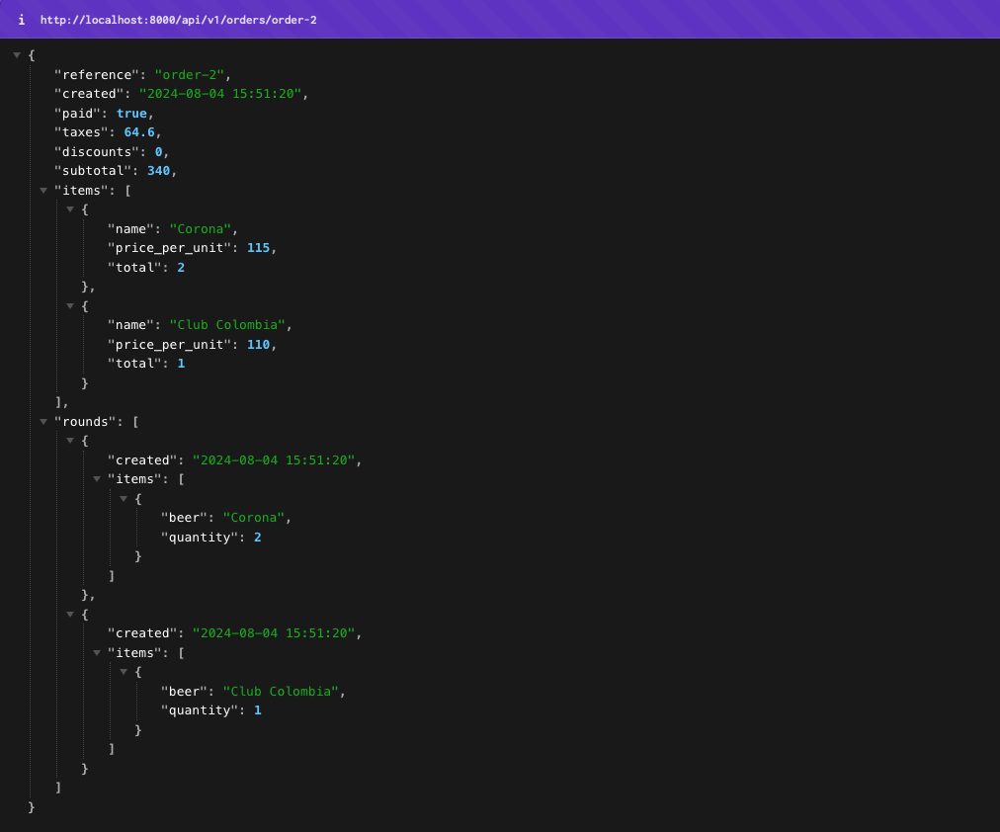
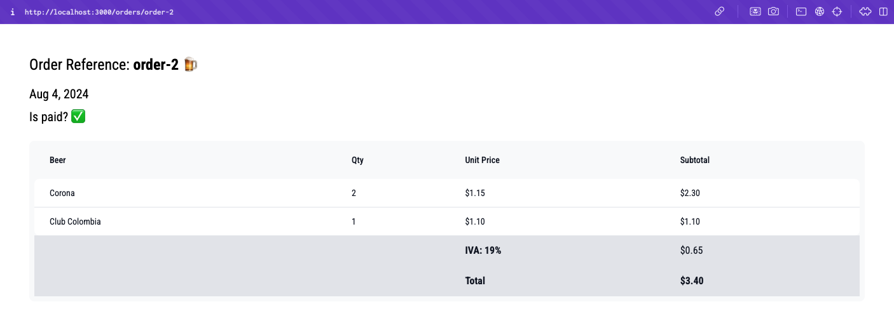

# Beershop

The challengue is described in the [CHALLENGUE.md](CHALLENGUE.md) file.

## Description

The domain model was implemented in the [`backend/domain`](backend/domain) and the UML model is the following:


## Requirements

- [Docker](https://www.docker.com/) and [docker compose](https://docs.docker.com/compose/).
- [Make](https://www.gnu.org/software/make/).

## Running the project

```sh
make setup # Sets env vars.
make build
make up # It runs the backend and frontend containers
```

The **frontend** is available at http://localhost:3000 and the **backend** at http://localhost:8000.

> [!IMPORTANT]
> When the local server is running [the orders are populated using this script](backend/populate.py).

**Backend sample endpoints:**
- http://localhost:8000/api/v1/orders/order-1/
- http://localhost:8000/api/v1/orders/order-2/



**Frontend sample pages:**
- http://localhost:3000/orders/order-1
- http://localhost:3000/orders/order-2



### Running the tests

```sh
# Backend
make -f Makefile.backend test
```

### Formatting and linting

```sh
# Backend
make -f Makefile.backend mypy
make -f Makefile.backend black
# Frontend
make -f Makefile.frontend lint
```

### Running the servers individually

#### Backend server

This runs the FASTApi server in your local machine in the port 8000.
```sh
make -f Makefile.backend runserver
```


#### Frontend server

This runs a NEXT.js server in your local machine in the port 3000.
```sh
make -f Makefile.frontend dev
```

### Makefile

There are more useful common commands in the [Makefile](Makefile). For the backend and frontend, there are specific Makefiles.
  - [Makefile.backend](Makefile.backend)
  - [Makefile.frontend](Makefile.frontend)

